# Use Case Diagram — SyncDrive

```mermaid
%%{init: {"theme": "dark"}}%%
graph LR
    Driver(["👤 Driver"])
    System(["🖥️ SyncDrive App"])

    Driver --> UC1["Select Origin & Destination"]
    Driver --> UC2["Set Arrival Time"]
    Driver --> UC3["Calculate Green Wave Route"]
    Driver --> UC4["View Recommended Speed"]
    Driver --> UC5["View Departure Time"]
    Driver --> UC6["Compare vs Normal GPS"]
    Driver --> UC7["View Signal Timeline"]
    Driver --> UC8["View Turn-by-Turn Steps"]

    UC3 --> UC9["<<include>> Run Green Wave Optimizer"]
    UC3 --> UC10["<<include>> Run Normal GPS Simulation"]
    UC3 --> UC11["<<include>> Render Route on Map"]
    UC9 --> UC12["<<include>> Simulate Signal Phases"]
    UC10 --> UC12

    UC11 --> UC13["<<extend>> Colour Signals Green/Red"]
    UC11 --> UC14["<<extend>> Show Speed HUD Overlay"]
```

## Description

| Use Case | Actor | Description |
|---|---|---|
| Select Origin & Destination | Driver | Choose from 7 Chandigarh locations |
| Set Arrival Time | Driver | Target time to reach destination |
| Calculate Green Wave Route | Driver | Triggers full optimization pipeline |
| View Recommended Speed | Driver | Steady km/h to maintain on route |
| View Departure Time | Driver | Optimal leave-at time |
| Compare vs Normal GPS | Driver | Time saved, reds avoided, wait time |
| View Signal Timeline | Driver | Per-signal green/red status + arrival time |
| View Turn-by-Turn Steps | Driver | Street-level directions |
| Run Green Wave Optimizer | System | Searches 9 speeds × 25 min window |
| Run Normal GPS Simulation | System | Same departure, 50 km/h, accumulates waits |
| Simulate Signal Phases | System | phase = (dep + travel + elapsed) % cycle |
| Render Route on Map | System | Blue polyline + ghost red dashed overlay |
| Colour Signals Green/Red | System | Updates signal circle fill colours |
| Show Speed HUD Overlay | System | Bottom-right speed badge on map |
