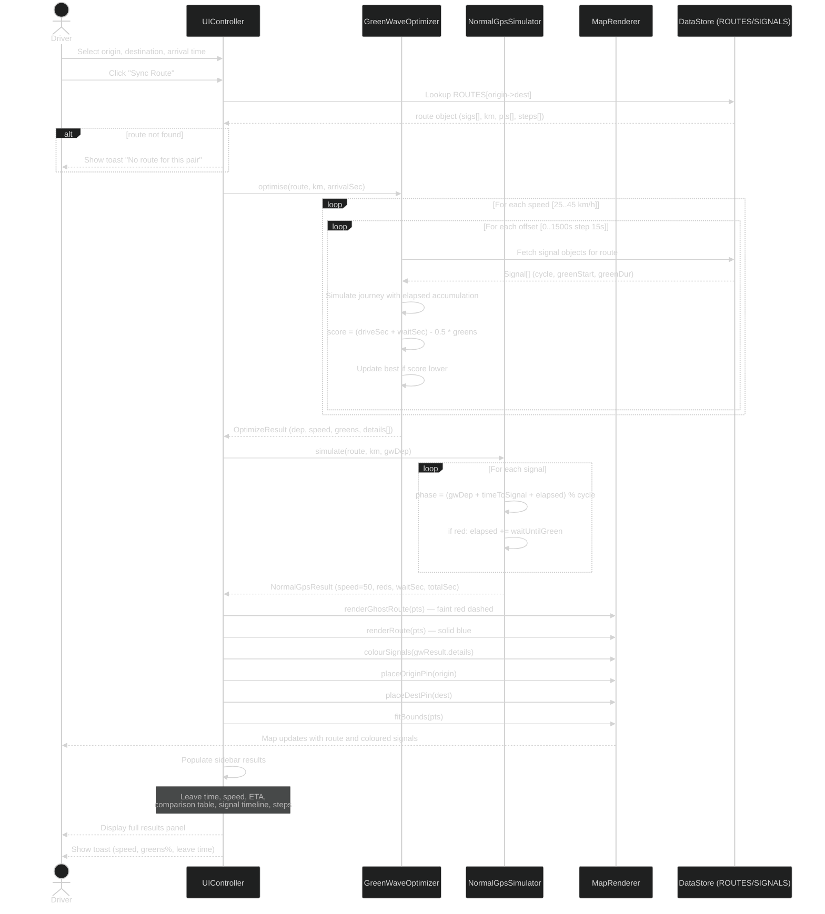

# Sequence Diagram — Calculate Route Flow

```mermaid
%%{init: {"theme": "dark"}}%%
sequenceDiagram
    actor Driver
    participant UI as UIController
    participant GWO as GreenWaveOptimizer
    participant NGS as NormalGpsSimulator
    participant Map as MapRenderer
    participant Data as DataStore (ROUTES/SIGNALS)

    Driver->>UI: Select origin, destination, arrival time
    Driver->>UI: Click "Sync Route"

    UI->>Data: Lookup ROUTES[origin->dest]
    Data-->>UI: route object (sigs[], km, pts[], steps[])

    alt route not found
        UI-->>Driver: Show toast "No route for this pair"
    end

    UI->>GWO: optimise(route, km, arrivalSec)
    loop For each speed [25..45 km/h]
        loop For each offset [0..1500s step 15s]
            GWO->>Data: Fetch signal objects for route
            Data-->>GWO: Signal[] (cycle, greenStart, greenDur)
            GWO->>GWO: Simulate journey with elapsed accumulation
            GWO->>GWO: score = (driveSec + waitSec) - 0.5 * greens
            GWO->>GWO: Update best if score lower
        end
    end
    GWO-->>UI: OptimizeResult (dep, speed, greens, details[])

    UI->>NGS: simulate(route, km, gwDep)
    loop For each signal
        NGS->>NGS: phase = (gwDep + timeToSignal + elapsed) % cycle
        NGS->>NGS: if red: elapsed += waitUntilGreen
    end
    NGS-->>UI: NormalGpsResult (speed=50, reds, waitSec, totalSec)

    UI->>Map: renderGhostRoute(pts) — faint red dashed
    UI->>Map: renderRoute(pts) — solid blue
    UI->>Map: colourSignals(gwResult.details)
    UI->>Map: placeOriginPin(origin)
    UI->>Map: placeDestPin(dest)
    UI->>Map: fitBounds(pts)
    Map-->>Driver: Map updates with route and coloured signals

    UI->>UI: Populate sidebar results
    Note over UI: Leave time, speed, ETA,<br/>comparison table, signal timeline, steps
    UI-->>Driver: Display full results panel

    UI-->>Driver: Show toast (speed, greens%, leave time)
```
