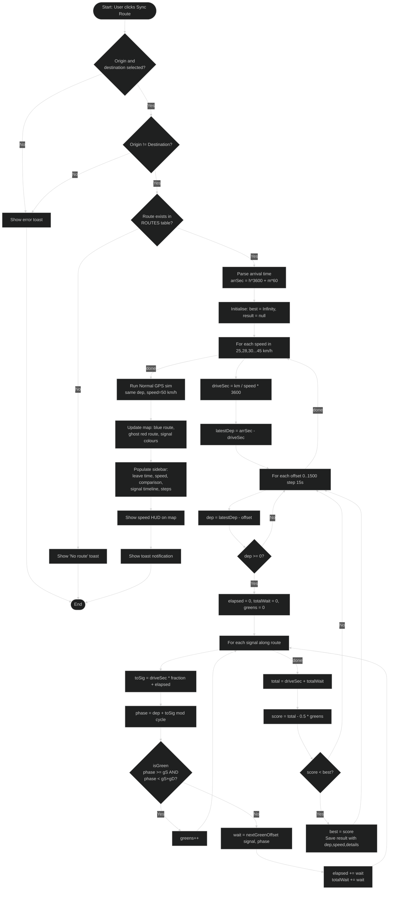

# Activity Diagram — Green Wave Optimizer

```mermaid
%%{init: {"theme": "dark"}}%%
flowchart TD
    A([Start: User clicks Sync Route]) --> B{Origin and\ndestination selected?}
    B -- No --> C[Show error toast] --> Z([End])
    B -- Yes --> D{Origin != Destination?}
    D -- No --> C
    D -- Yes --> E{Route exists in\nROUTES table?}
    E -- No --> F[Show 'No route' toast] --> Z
    E -- Yes --> G[Parse arrival time\narrSec = h*3600 + m*60]

    G --> H[Initialise: best = Infinity, result = null]
    H --> I[For each speed in 25,28,30...45 km/h]

    I --> J[driveSec = km / speed * 3600]
    J --> K[latestDep = arrSec - driveSec]
    K --> L[For each offset 0..1500 step 15s]

    L --> M[dep = latestDep - offset]
    M --> N{dep >= 0?}
    N -- No --> L
    N -- Yes --> O[elapsed = 0, totalWait = 0, greens = 0]

    O --> P[For each signal along route]
    P --> Q[toSig = driveSec * fraction + elapsed]
    Q --> R[phase = dep + toSig mod cycle]
    R --> S{isGreen\nphase >= gS AND\nphase < gS+gD?}

    S -- Yes --> T[greens++] --> P
    S -- No --> U[wait = nextGreenOffset signal, phase]
    U --> V[elapsed += wait\ntotalWait += wait] --> P

    P -- done --> W[total = driveSec + totalWait]
    W --> X[score = total - 0.5 * greens]
    X --> Y{score < best?}
    Y -- Yes --> AA[best = score\nSave result with dep,speed,details]
    AA --> L
    Y -- No --> L

    L -- done --> I
    I -- done --> AB[Run Normal GPS sim\nsame dep, speed=50 km/h]
    AB --> AC[Update map: blue route,\nghost red route, signal colours]
    AC --> AD[Populate sidebar:\nleave time, speed, comparison,\nsignal timeline, steps]
    AD --> AE[Show speed HUD on map]
    AE --> AF[Show toast notification]
    AF --> Z
```
