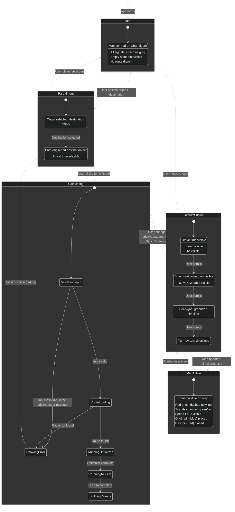

# State Machine Diagram — SyncDrive UI

```mermaid
%%{init: {"theme": "dark"}}%%
stateDiagram-v2
    [*] --> Idle : App loads

    state Idle {
        [*] --> MapReady
        MapReady : Map centred on Chandigarh
        MapReady : All signals shown as grey
        MapReady : Empty state hint visible
        MapReady : No route drawn
    }

    Idle --> PartialInput : User selects origin OR destination

    state PartialInput {
        [*] --> OriginSet
        OriginSet : Origin selected, destination empty
        OriginSet --> BothSet : Destination selected
        BothSet : Both origin and destination set
        BothSet : Arrival time editable
    }

    PartialInput --> Idle : User clears selection

    PartialInput --> Calculating : User clicks Sync Route

    state Calculating {
        [*] --> ValidatingInput
        ValidatingInput --> RouteLoading : Input valid
        ValidatingInput --> ShowingError : Input invalid\n(same origin/dest or missing)
        RouteLoading --> RunningOptimizer : Route found
        RouteLoading --> ShowingError : Route not found
        RunningOptimizer --> RunningNGSim : Optimizer complete
        RunningNGSim --> BuildingResults : NG sim complete
    }

    ShowingError --> PartialInput : Toast dismissed (4.5s)

    Calculating --> ResultsShown : Calculation complete

    state ResultsShown {
        [*] --> DisplayingRecommendation
        DisplayingRecommendation : Leave time visible
        DisplayingRecommendation : Speed visible
        DisplayingRecommendation : ETA visible
        DisplayingRecommendation --> DisplayingComparison : User scrolls
        DisplayingComparison : Time breakdown bars visible
        DisplayingComparison : NG vs GW table visible
        DisplayingComparison --> DisplayingSignals : User scrolls
        DisplayingSignals : Per-signal green/red timeline
        DisplayingSignals --> DisplayingSteps : User scrolls
        DisplayingSteps : Turn-by-turn directions
    }

    state MapActive {
        [*] --> RouteDrawn
        RouteDrawn : Blue polyline on map
        RouteDrawn : Red ghost dashed polyline
        RouteDrawn : Signals coloured green/red
        RouteDrawn : Speed HUD visible
        RouteDrawn : Origin pin (blue) placed
        RouteDrawn : Dest pin (red) placed
    }

    ResultsShown --> MapActive : Map updated simultaneously
    MapActive --> ResultsShown : Sidebar interaction

    ResultsShown --> Calculating : User changes origin/dest\nand clicks Sync Route again
    ResultsShown --> Idle : User reloads page
```
