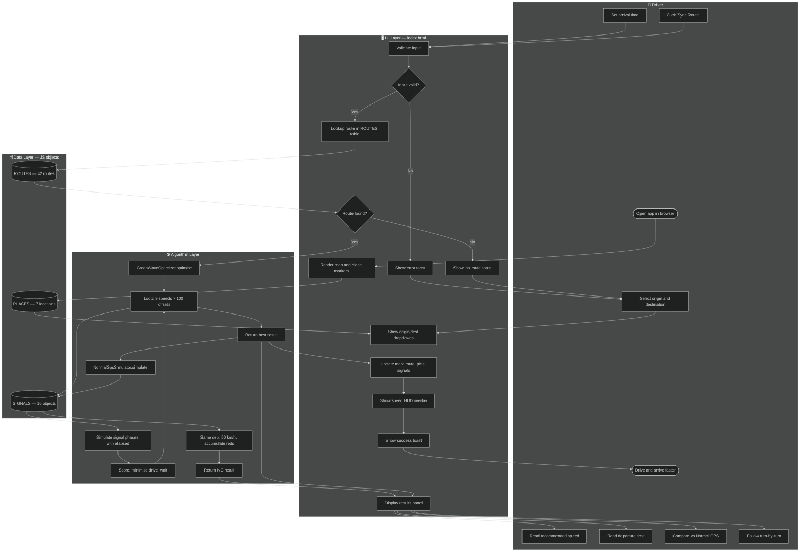

# Swimlane Diagram — SyncDrive Route Calculation Process

```mermaid
%%{init: {"theme": "dark"}}%%
flowchart TD
    subgraph DRIVER ["👤 Driver"]
        D1([Open app in browser])
        D2[Select origin and destination]
        D3[Set arrival time]
        D4[Click 'Sync Route']
        D5[Read recommended speed]
        D6[Read departure time]
        D7[Compare vs Normal GPS]
        D8[Follow turn-by-turn]
        D9([Drive and arrive faster])
    end

    subgraph UI ["🖥️ UI Layer — index.html"]
        U1[Render map and place markers]
        U2[Show origin/dest dropdowns]
        U3[Validate input]
        U4{Input valid?}
        U5[Show error toast]
        U6[Lookup route in ROUTES table]
        U7{Route found?}
        U8[Show 'no route' toast]
        U9[Display results panel]
        U10[Update map: route, pins, signals]
        U11[Show speed HUD overlay]
        U12[Show success toast]
    end

    subgraph ALGO ["⚙️ Algorithm Layer"]
        A1[GreenWaveOptimizer.optimise]
        A2[Loop: 9 speeds × 100 offsets]
        A3[Simulate signal phases with elapsed]
        A4[Score: minimise drive+wait]
        A5[Return best result]
        A6[NormalGpsSimulator.simulate]
        A7[Same dep, 50 km/h, accumulate reds]
        A8[Return NG result]
    end

    subgraph DATA ["🗄️ Data Layer — JS objects"]
        DA1[(PLACES — 7 locations)]
        DA2[(SIGNALS — 16 objects)]
        DA3[(ROUTES — 42 routes)]
    end

    D1 --> U1
    U1 --> DA1
    DA1 --> U2
    D2 --> U2
    D3 --> U3
    D4 --> U3
    U3 --> U4
    U4 -- No --> U5 --> D2
    U4 -- Yes --> U6
    U6 --> DA3
    DA3 --> U7
    U7 -- No --> U8 --> D2
    U7 -- Yes --> A1
    A1 --> A2
    A2 --> DA2
    DA2 --> A3
    A3 --> A4
    A4 --> A2
    A2 --> A5
    A5 --> A6
    A6 --> DA2
    DA2 --> A7
    A7 --> A8
    A8 --> U9
    A5 --> U9
    U9 --> D5
    U9 --> D6
    U9 --> D7
    U9 --> D8
    A5 --> U10
    U10 --> U11
    U11 --> U12
    U12 --> D9
```
