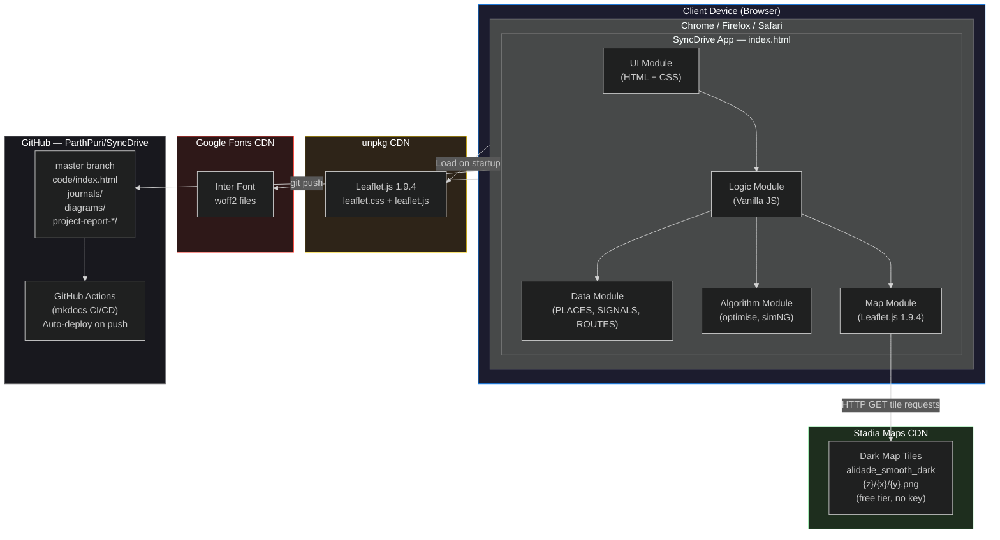

# Deployment Diagram — SyncDrive

## Notes

| Component | Location | Notes |
|---|---|---|
| Application | Client browser | Single HTML file, no server |
| Map tiles | Stadia CDN | Free tier, no API key needed |
| Leaflet.js | unpkg CDN | Loaded at startup |
| Inter font | Google Fonts CDN | Loaded at startup |
| All data | Embedded in HTML | PLACES, SIGNALS, ROUTES as JS objects |
| All logic | Embedded in HTML | Optimizer and simulator run in-browser |
| CI/CD | GitHub Actions | mkdocs auto-deploy on master push |

> **Key point:** There is no backend server. The application is entirely client-side. The only network requests at runtime are tile fetches from Stadia Maps.
