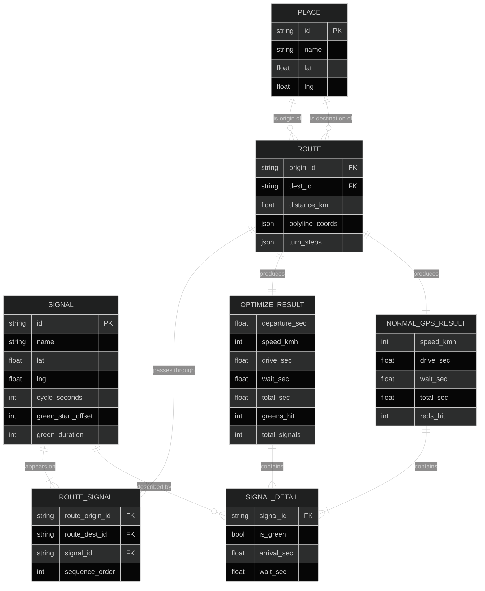

# Entity-Relationship Diagram — SyncDrive Data Model

## Entity Descriptions

| Entity | Description |
|---|---|
| `PLACE` | A named location (Sector 17, PGI, etc.) with coordinates |
| `SIGNAL` | A traffic signal with cycle timing and green phase offsets |
| `ROUTE` | A directed path between two places with distance and polyline |
| `ROUTE_SIGNAL` | Junction table: which signals appear on which route, in order |
| `OPTIMIZE_RESULT` | Output of the GreenWave optimizer for a given route + arrival time |
| `NORMAL_GPS_RESULT` | Output of the Normal GPS simulation for comparison |
| `SIGNAL_DETAIL` | Per-signal breakdown: arrival time, green/red, wait cost |

## Key Relationships

- One `PLACE` can be the origin of many `ROUTE`s
- One `PLACE` can be the destination of many `ROUTE`s  
- One `ROUTE` passes through 2–6 `SIGNAL`s (via `ROUTE_SIGNAL`)
- Each `SIGNAL` can appear on multiple `ROUTE`s
- One `ROUTE` produces exactly one `OPTIMIZE_RESULT` per calculation
- One `ROUTE` produces exactly one `NORMAL_GPS_RESULT` per calculation
- Both result types contain one `SIGNAL_DETAIL` per signal on the route
